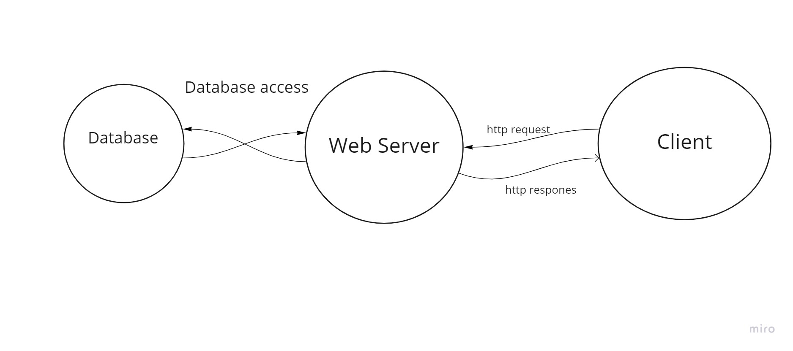

# City Exploer

## Author: Hamzah Aldaamas Version: 1.0.0.

# Overview
 > BookShop page using Auth0 to make login  to page and you can make shoping
## Getting Started
1. Click on Login button
2. login using gmail or anything else.
3. then you can make shop.
4. you can make logout

## Architecture
ReactJs, CSS, Auth0, BootStrap, MongoDB, axios

## Change Log

## Credit and Collaborations

Name of feature: login & logout

Estimate of time needed to complete: 1 hour

Start time: 1:30

Finish time: 2:30

Actual time needed to complete: 1 hour 

Name of feature: get data from MongoDB

Estimate of time needed to complete: 1 hour

Start time: 8:30

Finish time: 9:30

Actual time needed to complete: 1 hour 

Name of feature: add formModle to post method

Estimate of time needed to complete: 1 hour

Start time: 7:30

Finish time: 8:30

Actual time needed to complete: 1 hour 

Name of feature: delet method 

Estimate of time needed to complete: 1 hour

Start time: 8:30

Finish time: 9:30

Actual time needed to complete: 1 hour 

Name of feature: put method

Estimate of time needed to complete: 1 hour

Start time: 9:30

Finish time: 10:30

Actual time needed to complete: 1 hour 
